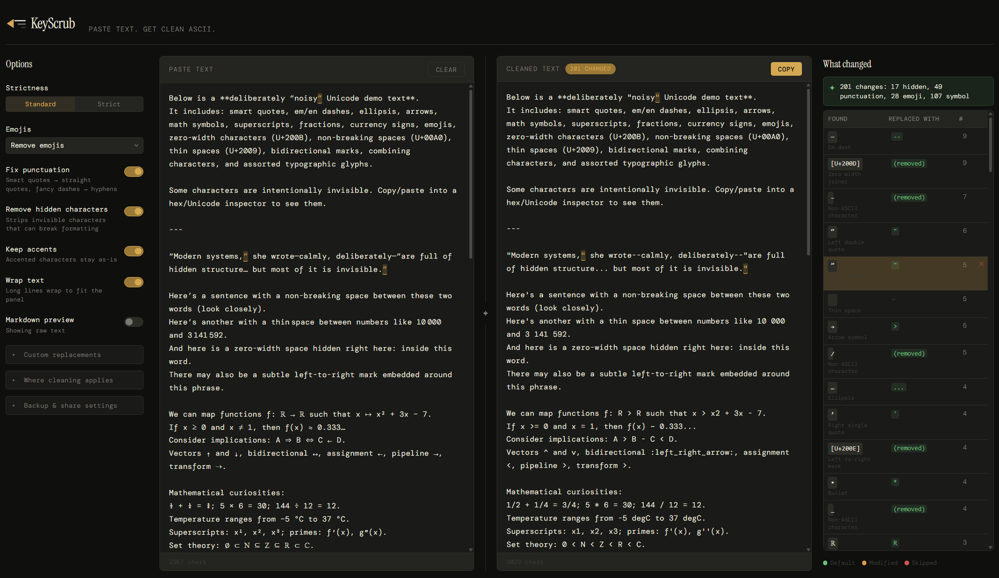

# KeyScrub

A browser-based Unicode text cleaner. Paste text, get clean ASCII.



## What it does

KeyScrub detects and converts non-ASCII characters that cause problems in code, data processing, and plain text environments. It handles smart quotes, invisible Unicode characters, em dashes, non-breaking spaces, emojis, accented characters, and more.

Everything runs client-side -- no data leaves your browser.

## Features

- **Smart punctuation cleanup** -- curly quotes > straight quotes, em dashes > hyphens, ellipsis characters > `...`
- **Hidden character removal** -- zero-width spaces, byte order marks, directional marks, soft hyphens
- **Emoji handling** -- remove, keep, or convert to text descriptions
- **Accent simplification** -- optionally convert accented characters to ASCII equivalents (é > e)
- **Code and link preservation** -- fenced code blocks and URLs are left untouched
- **Real-time change log** -- see every conversion with counts, inline editing, and skip/restore controls
- **Custom replacement rules** -- define your own find-and-replace mappings
- **Hover highlighting** -- hover a change to highlight it in both input and output panels
- **Markdown preview** -- toggle rendered markdown view for both panels
- **Settings import/export** -- save and share your configuration as JSON
- **Standard and Strict modes** -- quick presets for common use cases

## Getting started

```bash
npm install
npm run dev
```

## Build

```bash
npm run build
```

Output goes to `dist/`.

## Project structure

```
src/
├── App.jsx                  # Root component and layout
├── App.css                  # Application styles
├── main.jsx                 # Entry point
├── components/
│   ├── Header.jsx           # App header
│   ├── common/              # Reusable UI components
│   └── panels/              # Main layout panels
│       ├── OptionsPanel.jsx    # Settings and custom rules
│       ├── TextWorkspace.jsx   # Input/output text panels
│       └── ChangesPanel.jsx    # Change log sidebar
├── hooks/
│   └── useConverter.js      # Core state management hook
└── lib/
    ├── convertText.js       # Text conversion engine
    ├── analyzeText.js       # Character analysis
    ├── defaultRules.js      # Built-in replacement rules
    ├── presets.js            # Standard/Strict presets
    ├── settingsIO.js        # Settings import/export
    └── utils.js             # Shared utilities
```

## Tech stack

- React
- Vite
- [any-ascii](https://github.com/anyascii/anyascii) for Unicode transliteration
- [marked](https://github.com/markedjs/marked) for Markdown rendering

## License

MIT